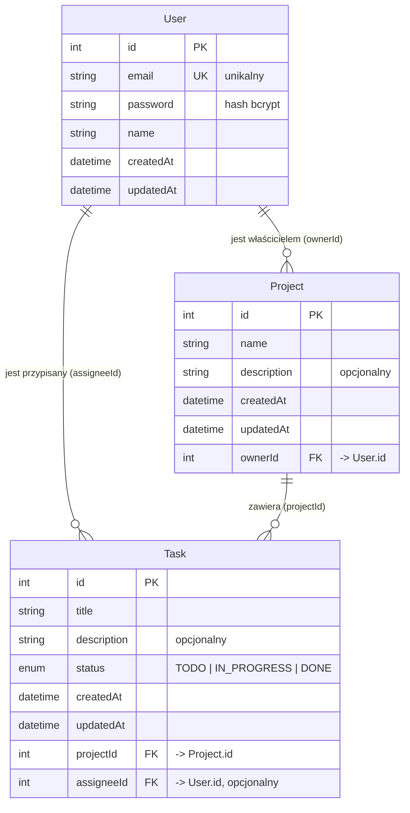

# Baza danych

Aplikacja korzysta z relacyjnej bazy danych **MySQL / MariaDB**, obsługiwanej przez ORM **Prisma** (z adapterem `@prisma/adapter-mariadb`). Schemat źródłowy znajduje się w pliku [`backend/prisma/schema.prisma`](../backend/prisma/schema.prisma), a migracje w katalogu [`backend/prisma/migrations`](../backend/prisma/migrations).

## Diagram ER

## Opis tabel

### User (użytkownik)
Przechowuje konta użytkowników aplikacji.

| Pole | Typ | Opis |
|------|-----|------|
| `id` | Int, PK, auto-increment | Identyfikator użytkownika |
| `email` | String, unikalny | Adres e-mail (login) |
| `password` | String | Hasło zahaszowane algorytmem bcrypt |
| `name` | String | Imię / nazwa użytkownika |
| `createdAt` | DateTime | Data utworzenia konta |
| `updatedAt` | DateTime | Data ostatniej modyfikacji |

Relacje: jeden użytkownik może być właścicielem wielu projektów (`projects`) oraz może być przypisany do wielu zadań (`tasks`).

### Project (projekt)
Reprezentuje projekt należący do jednego użytkownika.

| Pole | Typ | Opis |
|------|-----|------|
| `id` | Int, PK, auto-increment | Identyfikator projektu |
| `name` | String | Nazwa projektu |
| `description` | String, opcjonalny | Opis projektu |
| `createdAt` | DateTime | Data utworzenia |
| `updatedAt` | DateTime | Data ostatniej modyfikacji |
| `ownerId` | Int, FK -> `User.id` | Właściciel projektu |

Relacje: projekt należy do jednego użytkownika (`owner`) i zawiera wiele zadań (`tasks`). Usunięcie projektu powoduje wcześniejsze usunięcie powiązanych zadań (logika w `projectController.deleteProject`).

### Task (zadanie)
Pojedyncze zadanie w obrębie projektu.

| Pole | Typ | Opis |
|------|-----|------|
| `id` | Int, PK, auto-increment | Identyfikator zadania |
| `title` | String | Tytuł zadania |
| `description` | String, opcjonalny | Opis zadania |
| `status` | Enum (`TODO`, `IN_PROGRESS`, `DONE`) | Status, domyślnie `TODO` |
| `createdAt` | DateTime | Data utworzenia |
| `updatedAt` | DateTime | Data ostatniej modyfikacji |
| `projectId` | Int, FK -> `Project.id` | Projekt, do którego należy zadanie |
| `assigneeId` | Int, FK -> `User.id`, opcjonalny | Użytkownik przypisany do zadania |

Relacje: zadanie należy do jednego projektu (`project`) i opcjonalnie ma jednego przypisanego użytkownika (`assignee`).

## Statusy zadania

Pole `status` przyjmuje jedną z trzech wartości:

- `TODO` – do zrobienia (wartość domyślna),
- `IN_PROGRESS` – w toku,
- `DONE` – zrobione.
